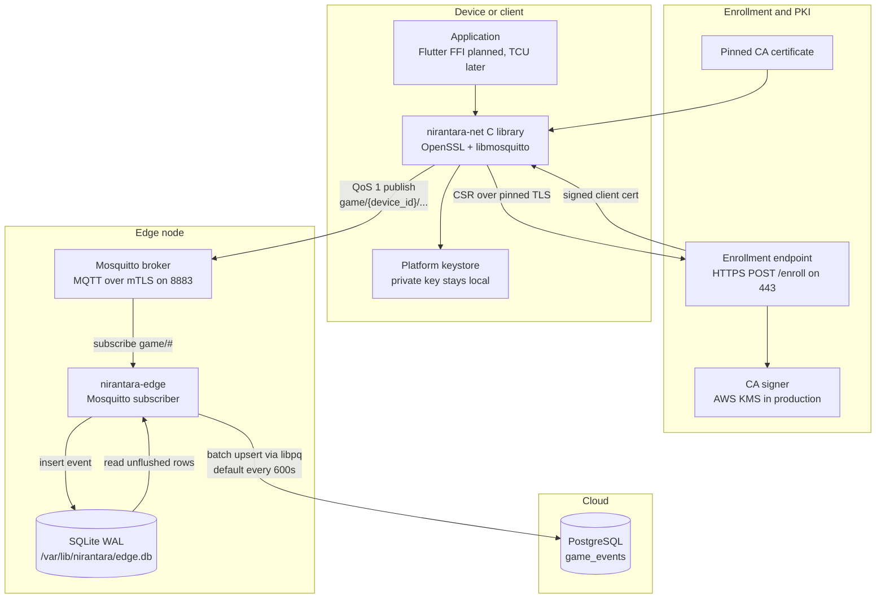

# Project Nirantara Architecture

Nirantara is an edge-native telemetry and messaging stack. The current workload is
a multiplayer gaming backend, while the long-term target is connected vehicle
telematics on embedded Linux.

## System diagram



## Runtime flow

1. The client application calls `nirantara-net` through the public C API.
2. On first run, `nirantara-net` generates an ECDSA P-256 key pair, builds a CSR
   with `device_id` as the certificate common name, and posts it to `/enroll`
   over pinned TLS.
3. The enrollment service validates and signs the CSR, then returns the client
   certificate. In production, CA signing is expected to happen through KMS.
4. The client connects to the edge Mosquitto broker with MQTT over mTLS and
   publishes telemetry or gameplay events with QoS 1.
5. `nirantara-edge` subscribes to the configured topic pattern, `game/#` by
   default, and writes each MQTT payload to the SQLite event buffer.
6. A sync thread reads unflushed SQLite rows using a separate WAL-compatible
   connection and upserts them into cloud PostgreSQL through libpq.
7. Successfully synced SQLite rows are marked as flushed. Postgres uses
   `ON CONFLICT DO NOTHING` so retries are idempotent.

## Component boundaries

| Component | Owns | Does not own |
| --- | --- | --- |
| `lib/nirantara-net` | TLS context, CA pinning, key generation, CSR enrollment, mTLS MQTT | Business routing, buffering, database sync |
| `edge` | MQTT subscription, SQLite buffering, Postgres sync | Client authentication policy, TLS implementation |
| Mosquitto | mTLS broker endpoint and topic routing | Event persistence or cloud sync |
| PostgreSQL | Authoritative event store and reporting source | Edge buffering or retry state |

## Data stores

### SQLite edge buffer

The edge agent stores events locally before cloud sync:

```sql
CREATE TABLE events (
    id       INTEGER PRIMARY KEY AUTOINCREMENT,
    topic    TEXT    NOT NULL,
    payload  BLOB    NOT NULL,
    ts       INTEGER NOT NULL DEFAULT (unixepoch()),
    flushed  INTEGER NOT NULL DEFAULT 0
);
CREATE INDEX idx_events_flushed ON events(flushed, ts);
```

SQLite runs in WAL mode so the MQTT callback can insert events while the sync
thread reads unflushed rows from a separate connection.

### Cloud PostgreSQL

The edge sync target is the `game_events` table:

```sql
CREATE TABLE game_events (
    device_id  TEXT    NOT NULL,
    topic      TEXT    NOT NULL,
    payload    JSONB   NOT NULL,
    ts         BIGINT  NOT NULL,
    edge_node  TEXT    NOT NULL,
    PRIMARY KEY (device_id, topic, ts)
);
```

The `device_id` is parsed from MQTT topics shaped like
`game/<device_id>/events`.

## Security invariants

- Private keys stay on the device or secure enclave. Enrollment sends a CSR, not
  private key material.
- TLS uses a pinned Nirantara CA certificate and a TLS 1.2 minimum.
- MQTT requires mutual TLS client certificates.
- Edge buffering survives broker restarts because MQTT ingest and cloud sync are
  decoupled by SQLite WAL.
- Cloud sync is retry-safe because Postgres writes are idempotent upserts.

## Implementation status

Implemented in this repository:

- `lib/nirantara-net`: C11 client networking library.
- `edge`: Mosquitto subscriber, SQLite buffer, and Postgres sync agent.
- `tools/ca`: development CA generation script.

Architectural target or external deployment dependency:

- Flutter FFI bindings.
- Enrollment service and production KMS-backed CA signing.
- Mosquitto broker configuration and cloud PostgreSQL deployment.
